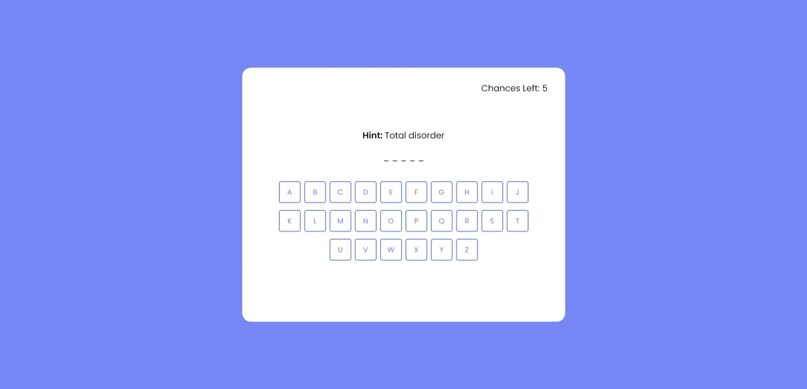

# Word_Guessing_Game_Javascript

### Este proyecto esta desarrollado con html, css y javascript 
---
### El proyecto trata de un sitio que te muestra letras y presionando esas letras si le atinaste a la letra de la palabra y si no te pone un texto disiendo "Incorrect Letter" y si le atinas a la letra te dice "Correct Letter" es para diversion  
---
### Previsualización

---
[**Ir a la página** ✌](https://luisangelponcealvarez.github.io/Word_Guessing_Game_Javascript/)
---